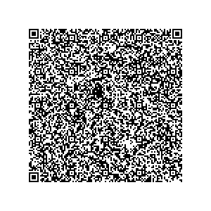
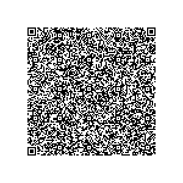

# Switzerland - Test files

---

This directory contains test files produced by the Swiss Federal Office of Public Health FOPH.
The software used to produce the QR codes can be found at https://github.com/admin-ch.

## Test files

### 1 - Vaccination

[1.json](2DCode/raw/1.json) - Basic DGC with one vaccination entry (created with release 1.1).

All tests should be successful.

[1.png](png/1.png)

### 2 - Test

[2.json](2DCode/raw/2.json) - Basic DGC with one test entry (created with release 1.1).

All tests should be successful.

[2.png](png/2.png)

### 3 - Recovery

[3.json](2DCode/raw/3.json) - Basic DGC with one test entry (created with release 1.1).

All tests should be successful.

[3.png](png/3.png)

### 4 - Vaccination

[4.json](2DCode/raw/4.json) - Basic DGC with one vaccination entry (created with release 1.0). 

All tests should be successful.

[4.png](png/4.png)

### 5 - Test

[5.json](2DCode/raw/5.json) - Basic DGC with one test entry (created with release 1.0). 

All tests should be successful.

[5.png](png/5.png)

### 6 - Recovery

[6.json](2DCode/raw/6.json) - Basic DGC with one test entry (created with release 1.0).

All tests should be successful.

[6.png](png/6.png)

### 7 - Vaccination

[7.json](2DCode/raw/7.json) - Basic DGC with one vaccination entry (created with release 1.0). Optional claim "iss" has been changed to "CH".

All tests should be successful.

[7.png](png/7.png)

### 8 - Test

[8.json](2DCode/raw/8.json) - Basic DGC with one test entry (created with release 1.0). Optional claim "iss" has been changed to "CH".

All tests should be successful.

[8.png](png/8.png)

### 9 - Recovery

[9.json](2DCode/raw/9.json) - Basic DGC with one test entry (created with release 1.0). Optional claim "iss" has been changed to "CH".

All tests should be successful.

[9.png](png/9.png)

