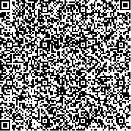
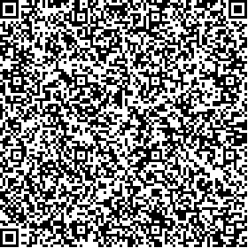
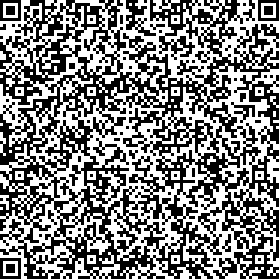

# Czechia

Test files generated by Ministry of Health of the Czech Republic
All DGC are signed with EC certifacate - method prime256v1

CZ issuing DSC in version 1.0.1 transfer to 1.3.0 is planned during 1st half of July

## Test files

### Vaccination

[1.json](2DCode/raw/1.json): DGC with vaccination entry. Vaccination finished. Version 1.0.1

[5.json](2DCode/raw/5.json): DGC with vaccination entry. Vacciantion in progress 1/2 doses. Version 1.0.1

[11.json](2DCode/raw/11.json): DGC with vaccination entry. Vaccination finished. Version 1.3.0

[15.json](2DCode/raw/15.json): DGC with vaccination entry. Vacciantion in progress 1/2 doses. Version 1.3.0

### Recovery

[2.json](2DCode/raw/2.json): DGC with recovery entry. Version 1.0.1

[12.json](2DCode/raw/12.json): DGC with recovery entry. Version 1.3.0

### NAA Test

[3.json](3DCode/raw/3.json): DGC with NAA test entry. Version 1.0.1

[13.json](3DCode/raw/13.json): DGC with NAA test entry.  Version 1.3.0

### RA Test

[4.json](4DCode/raw/4.json): DGC with RAT entry. Version 1.0.1

[14.json](4DCode/raw/14.json): DGC with RAT entry. Version 1.3.0

