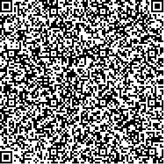

# Czechia

Test files generated by Ministry of Health of the Czech Republic
All DGC are signed with EC certifacate - method prime256v1

## Test files

### Vaccination

[1.json](2DCode/raw/1.json): DGC with vaccination entry. Vaccination finished.

[5.json](2DCode/raw/5.json): DGC with vaccination entry. Vacciantion in progress 1/2 doses

### Recovery

[2.json](2DCode/raw/2.json): DGC with recovery entry. 

### NAA Test

[3.json](3DCode/raw/3.json): DGC with NAA test entry. 

### RA Test

[4.json](4DCode/raw/4.json): DGC with RAT entry.

