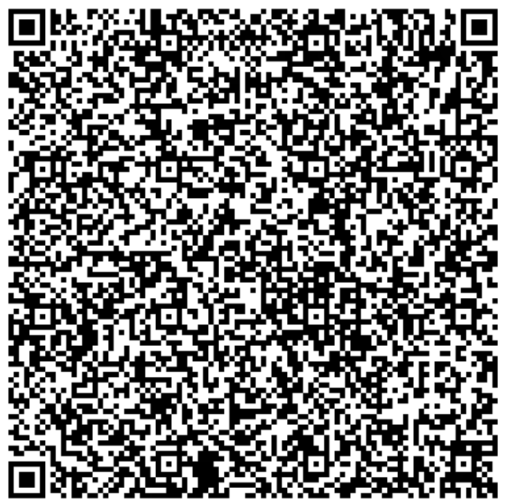
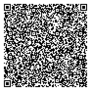

# Germany

---

### 1 - Vaccination certificate: Full immunisation

[1.json](2DCode/raw/1.json) - Basic DCC with one vaccination entry, full immunisation (2/2). Signed with a DSC uploaded in the ACC environment.

All tests should be successful.

### 2 - Test certificate

[2.json](2DCode/raw/2.json) - Basic DCC with one test entry. Signed with a DSC uploaded in the ACC environment.

All tests should be successful.

### 3 - Recovery certificate

[3.json](2DCode/raw/3.json) - Basic DCC with one recovery entry. Signed with a DSC uploaded in the ACC environment.

All tests should be successful.

### 4 - Vaccination certificate: Partial immunisation

[4.json](2DCode/raw/4.json) - Basic DCC with one vaccination entry, partial immunisation (1/2). Signed with a DSC uploaded in the ACC environment.

All tests should be successful.

