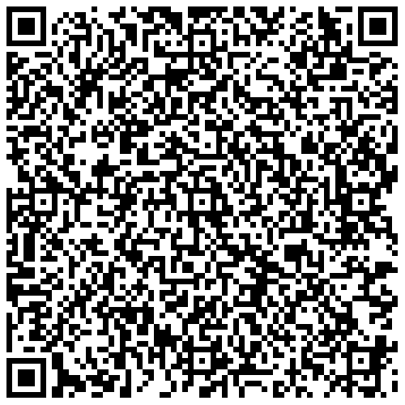
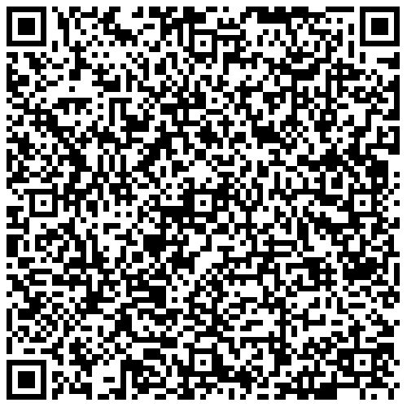
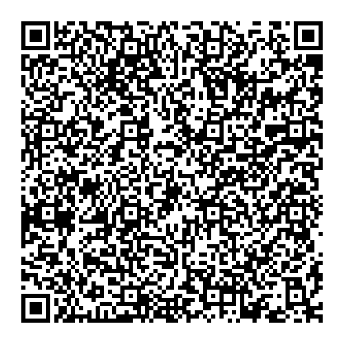
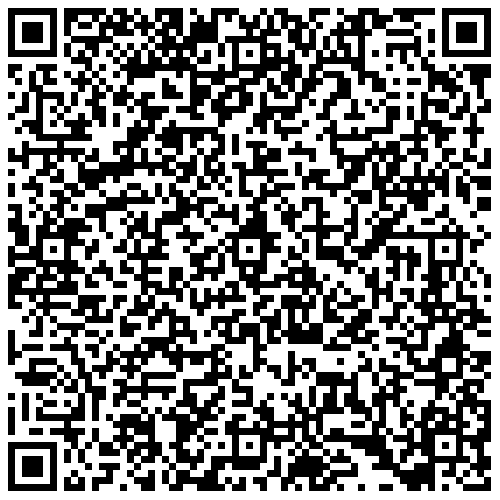

# Finland - Test DCC files

---

This directory contains DCC test files produced by the Social Insurance Institution of Finland, Kela.

## Test files

### 1

[1.json](2DCode/raw/1.json) - One vaccination entry. Only one vaccination in vaccination series (1/1). 

### 2

[2.json](2DCode/raw/2.json) - One vaccination entry. Two vaccinations in vaccination series (2/2).

### 3

[3.json](2DCode/raw/3.json) - One NAAT entry.

### 4

[4.json](2DCode/raw/4.json) - One RAT entry. 

### 5

[5.json](2DCode/raw/5.json) - One recovery entry. 

