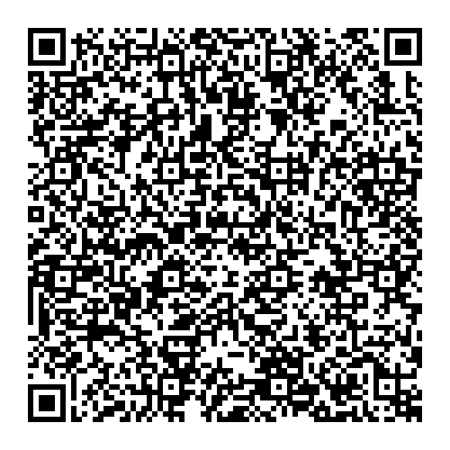

# Finland - Test DCC files

---

This directory contains DCC test files produced by the Social Insurance Institution of Finland, Kela.

## Test files Schema 1.0.0

### 1

[1.json](2DCode/raw/1.json) - One vaccination entry. Schema 1.0.0. Only one vaccination in vaccination series (1/1). 

### 2

[2.json](2DCode/raw/2.json) - One vaccination entry. Schema 1.0.0. Two vaccinations in vaccination series (2/2).

### 3

[3.json](2DCode/raw/3.json) - One NAAT entry. Schema 1.0.0.

### 4

[4.json](2DCode/raw/4.json) - One RAT entry. Schema 1.0.0.

### 5

[5.json](2DCode/raw/5.json) - One recovery entry. Schema 1.0.0.

## Test files Schema 1.3.0

### 6

[6.json](2DCode/raw/6.json) - One vaccination entry. Schema 1.3.0. Only one vaccination in vaccination series (1/1). 

### 7

[7.json](2DCode/raw/7.json) - One vaccination entry. Schema 1.3.0. Two vaccinations in vaccination series (2/2).

### 8

[8.json](2DCode/raw/8.json) - One NAAT entry. Schema 1.3.0.

### 4

[9.json](2DCode/raw/9.json) - One RAT entry. Schema 1.3.0.

### 10

[10.json](2DCode/raw/10.json) - One recovery entry. Schema 1.3.0.

## Test files for 31.1.2022 testing

### VAC_FI.png

[VAC_FI.png(png/VAC_FI.png)

### REC_FI.png

[REC_FI.png(png/REC_FI.png)

### TEST_FI.png

[TEST_FI.png(png/TEST_FI.png)
