# FRANCE - Test files

---

This directory contains test files produced by the FRANCE eHealth Agency.  
add 18 vaccine DCC test files from France Health Organization (CNAM) DGC_DL_QrCode_000xx

## Test files

### Vaccin test OK

   
  
  
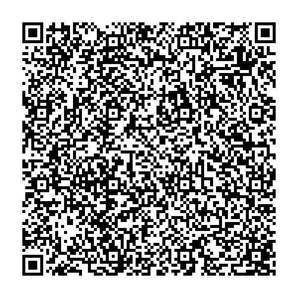  
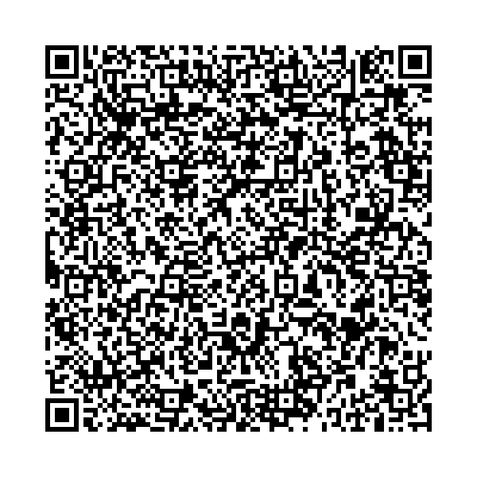  
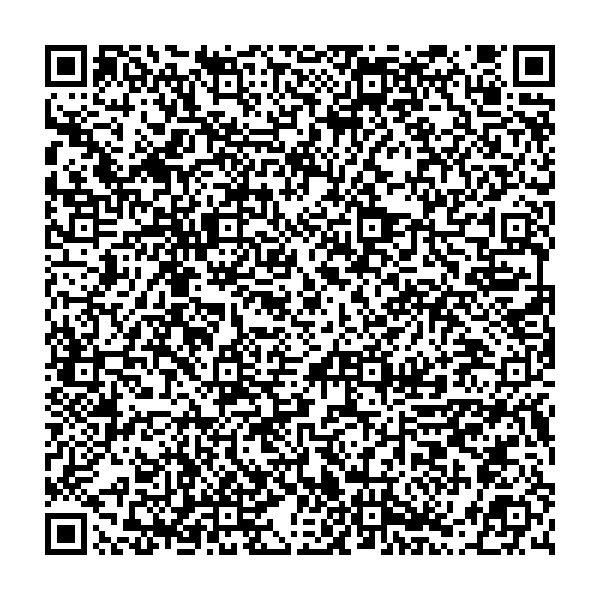  
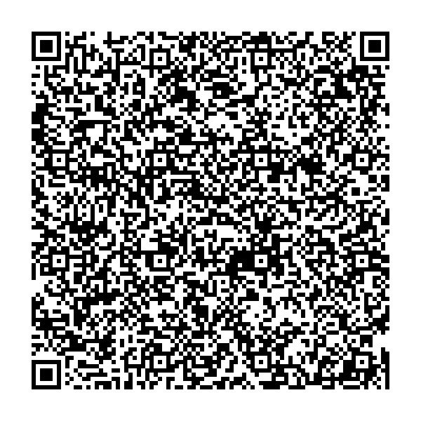  
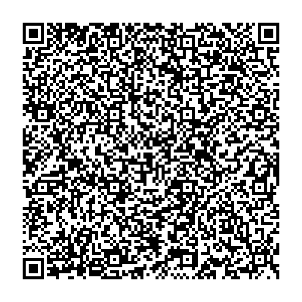  
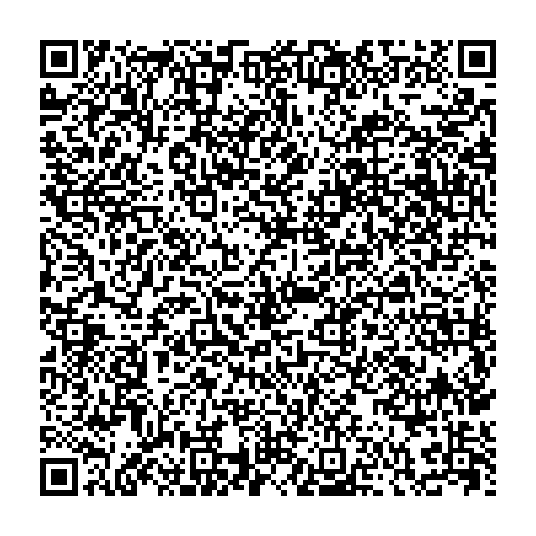  
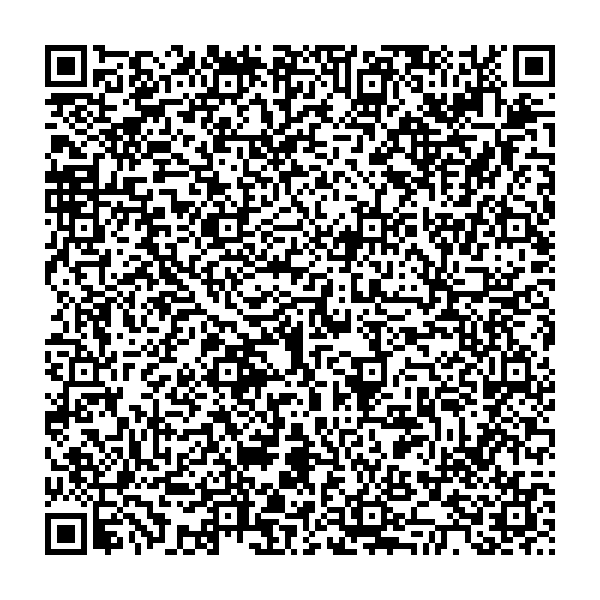  
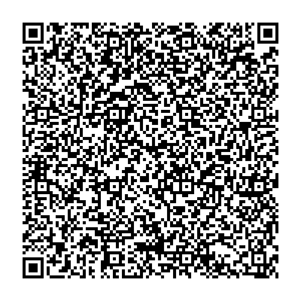  
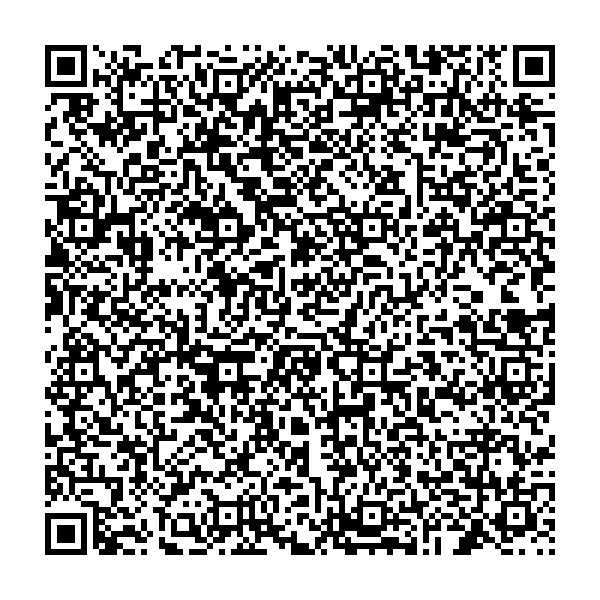  
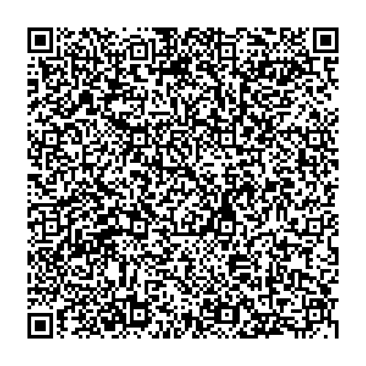  
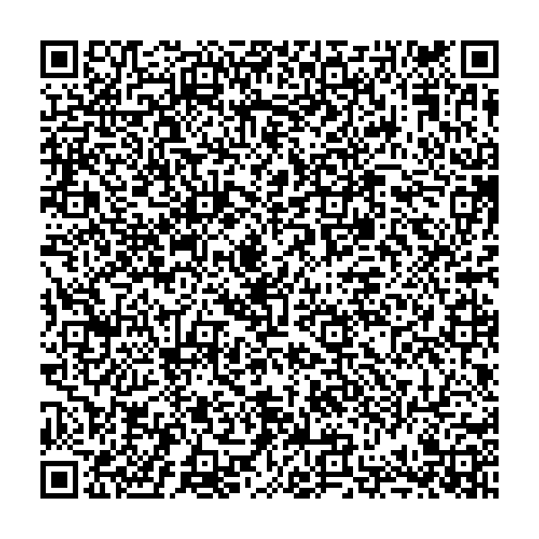  
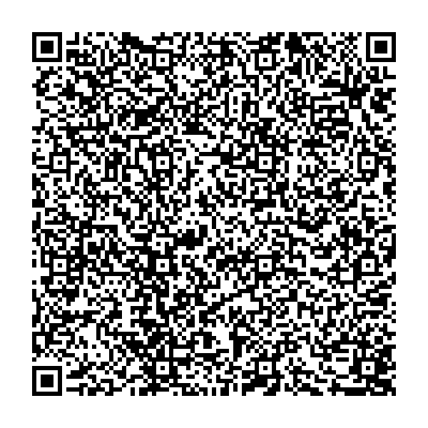  
  
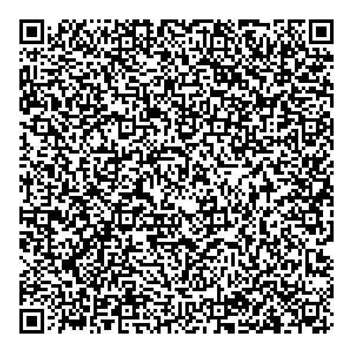  
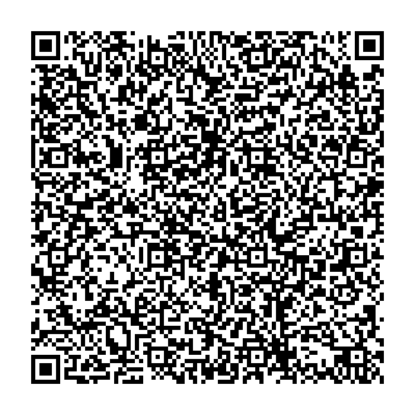  
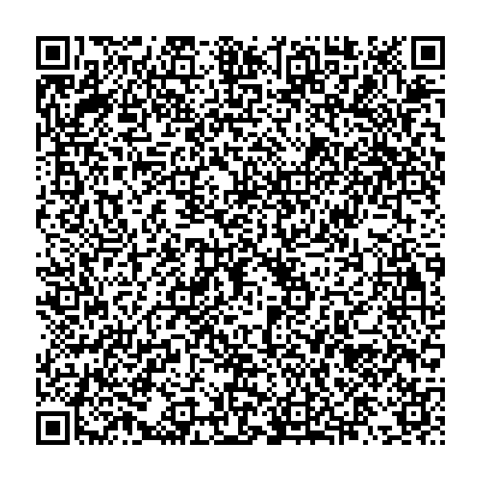  

### Test PCR OK

### Recovery OK

