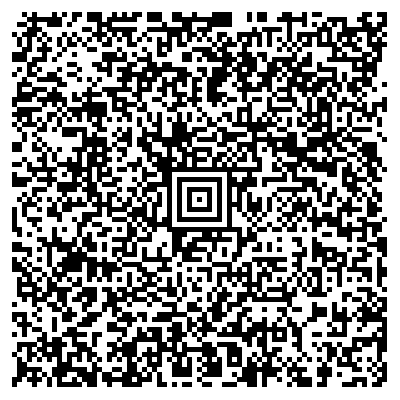

# Ireland, test files 

---

### 1 - Vaccination certificate: One immunisation event

[1.json](2DCode/raw/1.json) - Basic DCC with one vaccination entry

All tests should be successful.

[QR](png/1_qr.png)

[Aztec](png/1_aztec.png)

### 2 - Vaccination certificate: Two immunisation events

[2.json](2DCode/raw/2.json) - Basic DCC with two vaccination entries

All tests should be successful.

[QR](png/2_qr.png)

[Aztec](png/2_aztec.png)

### 3 - Test certificate

[3.json](2DCode/raw/3.json) - Basic DCC with one negative (RAT) test entry

All tests should be successful.

[QR](png/3_qr.png)

[Aztec](png/3_aztec.png)

### 4 - Recovery certificate

[4.json](2DCode/raw/4.json) - Basic DCC with one recovery entry

All tests should be successful.

[QR](png/4_qr.png)

[Aztec](png/4_aztec.png)

### 5 - DCC with two immunisation events, one negative test and one proof of recovery

[5.json](2DCode/raw/5.json) - Basic DCC with all three types

All tests should be successful.

[QR](png/5_qr.png)

[Aztec](png/5_aztec.png)

