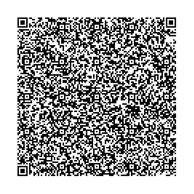
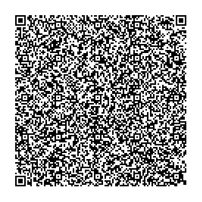

# Iceland - Test files

---

This directory contains test files produced by the Directorate of Health Iceland. 
The software used to produce the QR-codes can be found at https://github.com/ehn-digital-green-development/hcert-dotnet.

## Test files

### 1

[1.json](2DCode/raw/1.json) - Basic DGC with one vaccination entry. 

All tests should be successful.

### 2

[2.json](2DCode/raw/2.json) - Basic DGC with one test entry. 

All tests should be successful.

### 3

[2.json](2DCode/raw/3.json) -Negative PCR signed with RSA, no extened key usage

All tests should be successful.

### 3

[2.json](2DCode/raw/4.json) -Negative PCR signed with EC, no extened key usage

All tests should be successful.

