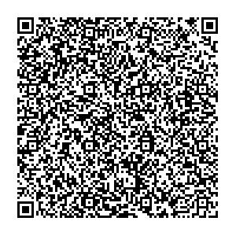
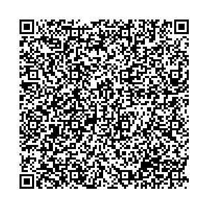
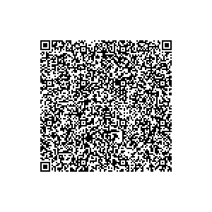
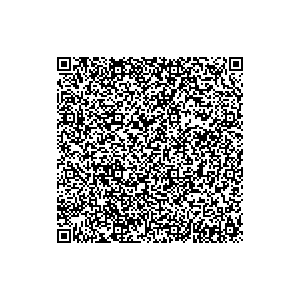

# Italy

Test data generated by Italy's team.

## Test files

### Vaccination test

DGC with vaccination entry: [1.json](2DCode/raw/1.json)

### Recovery test

DGC with recovery entry: [2.json](2DCode/raw/2.json)

### Antigen Test

DGC with antigen test entry: [3.json](2DCode/raw/3.json)

### Molecular Test

DGC with molecular test entry: [4.json](2DCode/raw/4.json)

