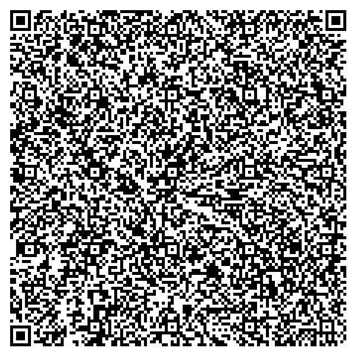

# Lithuania

## DGC Test files

### Vaccination

[1.json](2DCode/raw/1.json): Valid certificate with one 3/3 Comirnaty (EU/1/20/1528) vaccination entry.

### Test

[2.json](2DCode/raw/2.json): Valid certificate with one test entry for NAAT (Nucleic acid amplification with probe detection) where Covid not detected.

[3.json](2DCode/raw/3.json): Valid certificate with one test entry for RAT (Rapid Antigen Test) where Covid not detected.

### Recovery

[4.json](2DCode/raw/4.json): Valid certificate with one recovery entry.

