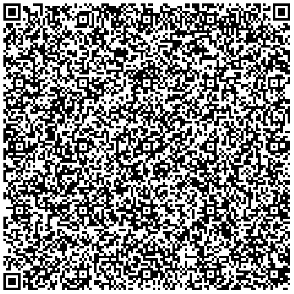

# Lithuania

## DGC Test files

### Vaccination

[1.json](2DCode/raw/1.json): Valid certificate with one vaccination entry.

### Test

[2.json](2DCode/raw/2.json): Valid certificate with test entry where Covid not detected.

### Recovery

[3.json](2DCode/raw/3.json): Valid certificate with recovery entry.

