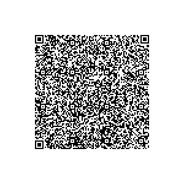

# Poland

This directory contains test files produced by the Poland National eHealth Authority (eHealth Center) - **1.2.1** schema.

## Test files

### Vaccination test (First Dose)

[1.json](2DCode/raw/1.json) - DGC with first vaccination entry Dose.
All tests should be successful.

### Vaccination test (Second Dose)

[2.json](2DCode/raw/2.json) - DGC with second vaccination entry Dose.
All tests should be successful.

### Recovery test

[3.json](2DCode/raw/3.json) - DGC with recovery entry.
All tests should be successful.

### Laboratory Test (NAA)

[4.json](2DCode/raw/4.json) - DGC with NAA test entry - valid until **2021-11-20 20:10:00 GMT+01:00**.
All tests should be successful.

### Laboratory Test (RAT)

[5.json](2DCode/raw/5.json) - DGC with RAT test entry - valid until **2021-11-20 12:20:00 GMT+01:00**.
All tests should be successful.

### Vaccination test (Second Dose)

[6.json](2DCode/raw/6.json) - DGC with second vaccination entry Dose.
Vaccination certificate signed with a recovery DSC. TESTCTX.CERTIFICATE includes a vaccination DSC.

### Laboratory Test (RAT)

[7.json](2DCode/raw/7.json) - DGC with RAT test entry.
Should not verify schema - incorrect device identification number.

### Recovery test

[8.json](2DCode/raw/8.json) - DGC with recovery entry.
Should not verify schema - incorrect country code.

### Vaccination test (Second Dose)

[9.json](2DCode/raw/9.json) - DGC with second vaccination entry Dose.
Should not verify schema - incorrect vaccine manufacturer identifier.

### Recovery test

[10.json](2DCode/raw/10.json) - DGC with recovery entry.
Certificate expired.

### Vaccination test (First Dose)

[11.json](2DCode/raw/11.json) - DGC with first vaccination entry Dose - date of vaccination with time.
All tests should be successful.

### Vaccination test (Second Dose)

[12.json](2DCode/raw/12.json) - DGC with second vaccination entry Dose - date of vaccination with time.
All tests should be successful.

### Vaccination test (One Dose)

[13.json](2DCode/raw/13.json) - DGC with one vaccination entry Dose - date of vaccination with time.
All tests should be successful.

