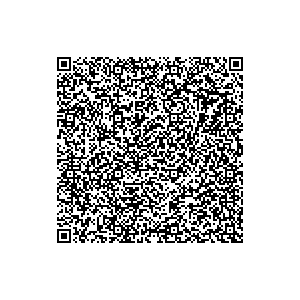
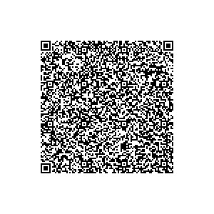
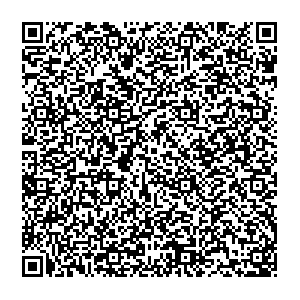
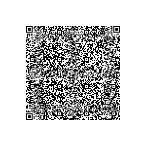

# Poland

This directory contains test files produced by the Poland National eHealth Authority (eHealth Center)

## Test files

### Vaccination test (First Dose)

[1.json](2DCode/raw/1.json) - DGC with first vaccination entry Dose.
All tests should be successful.

### Vaccination test (Second Dose)

[2.json](2DCode/raw/2.json) - DGC with second vaccination entry Dose.
All tests should be successful.

### Recovery test

[3.json](2DCode/raw/3.json) - DGC with recovery entry.
All tests should be successful.

### Laboratory Test

[4.json](2DCode/raw/4.json) - DGC with NAA test entry.
All tests should be successful.

