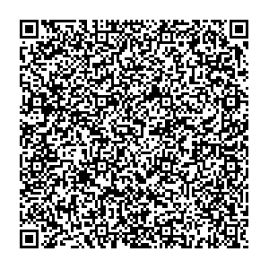
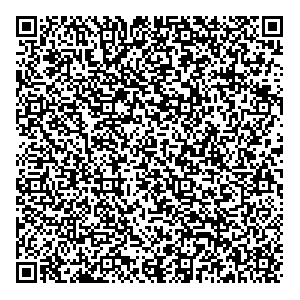
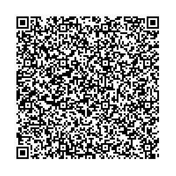
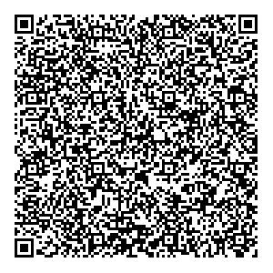

# Romania - Test files

---

This directory contains test files produced by the Romanian Ministry of Health.

## Test files

### 1

[1.json](2DCode/raw/1.json) - DGC with one vaccination entry.

All tests should be successful.

### 2

[2.json](2DCode/raw/2.json) - DGC with two vaccination entries.

All tests should be successful.

### 3

[3.json](2DCode/raw/3.json) - DGC with one recovery entry.

All tests should be successful.

### 4

[4.json](2DCode/raw/4.json) - DGC with one test entry.

All tests should be successful.

