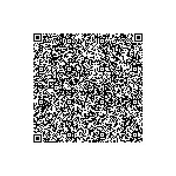
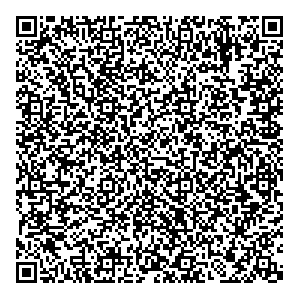
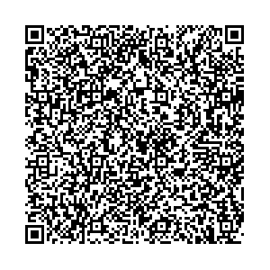

# Sweden - Test files

---

This directory contains test files produced by the Swedish eHealth Agency. The software used to produce the QR-codes can be found at https://github.com/DIGGSweden/dgc-java.

## Test files

### 1

[1.json](2DCode/raw/1.json) - One vaccination entry. 

Schema version 1.3.0. All tests should be successful.

### 2

[2.json](2DCode/raw/2.json) - One NAA test entry. The sc-attribute is tagged (0 tag before date-time).

Schema version 1.3.0. All tests should be successful.

*Note: Validity of DCC is extended for testing purposes.*

### 3

[3.json](2DCode/raw/3.json) - One NAA test entry. The sc-attribute is not tagged.

Schema version 1.3.0. All tests should be successful.

*Note: Validity of DCC is extended for testing purposes.*

### 4

[4.json](2DCode/raw/4.json) - One RAT test entry. 

Schema version 1.3.0. All tests should be successful.

*Note: Validity of DCC is extended for testing purposes.*

### 5

[5.json](2DCode/raw/5.json) - One recovery entry. 

Schema version 1.3.0. All tests should be successful.

