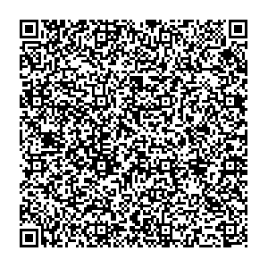
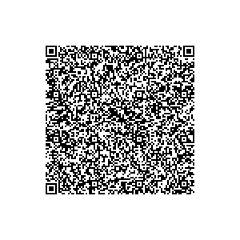

# Sweden - Test files

---

This directory contains test files produced by the Swedish eHealth Agency. The software used to produce the QR-codes can be found at https://github.com/DIGGSweden/dgc-java.

## Test files

### 1

[1.json](2DCode/raw/1.json) - Basic DGC with one vaccination entry. 

All tests should be successful.

### 2

[2.json](2DCode/raw/2.json) - Basic DGC with two vaccination entries. 

All tests should be successful.

### 3

[3.json](2DCode/raw/3.json) - Basic DGC with one vaccination entry. Signed with RSA. 

All tests should be successful.

### 4

[4.json](2DCode/raw/4.json) - Basic DGC with one vaccination entry. In this DGC no Cose_Sign1 message tag is included.

All tests should be successful.

### 5

[5.json](2DCode/raw/5.json) - Basic DGC with one vaccination entry. In this DGC both the CWT and Cose_Sign1 message tags are included.

All tests should be successful.

### 6

[6.json](2DCode/raw/6.json) - Basic DGC with one vaccination entry. Signed with another key than what is indicated.

Signature validation should fail.

