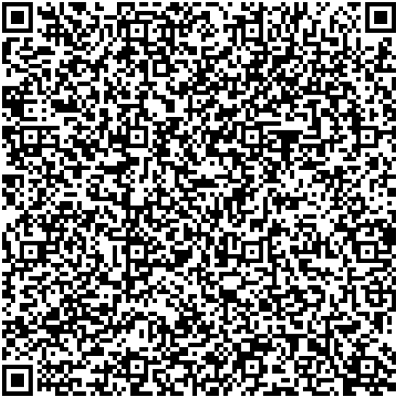
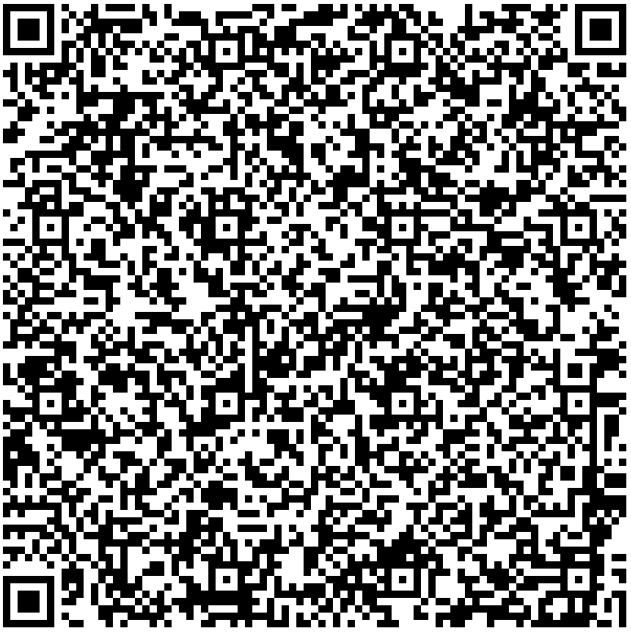

# Slovenia - Test files

---

This directory contains test files produced by the Slovenian development team. The DGCs were signed with a DSC from ACC NB. The software used to produce the QR-codes is based on https://github.com/DIGGSweden/dgc-java.

## Test files

### 1

[VAC](2DCode/raw/VAC.json) - One vaccination entry. 

All tests should be successful.

### REC

[REC.json](2DCode/raw/REC.json) - One recovery entry. 

All tests should be successful.

### TEST AG

[test-AG.json](2DCode/raw/test-AG.json) - One AntiGen test entry. The sc-attribute is not tagged (no 0 tag before date-time). Valid only for 72hrs.

All tests should be successful.

### TEST PCR

[test-PCR.json](2DCode/raw/test-PCR.json) - One PCR test entry.  Valid only for 72hrs.

All tests should be successful.

