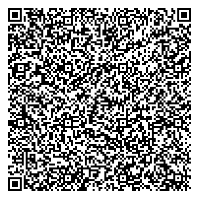
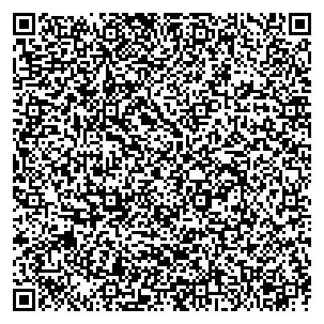
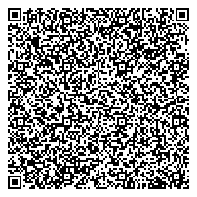
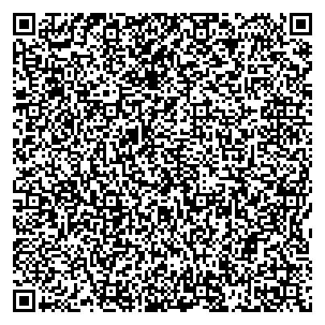

# Slovakia

Test files provided by National Health Information Center, Slovakia,
Schema version 1.2.1

## Test files

### Vaccination

[1.json](2DCode/raw/1.json): DGC with vaccination entry (1 dose)

[2.json](2DCode/raw/2.json): DGC with vaccination entry Comirnaty (1 dose)

[3.json](2DCode/raw/3.json): DGC with vaccination entry Astra (2 doses)

[4.json](2DCode/raw/4.json): DGC with vaccination entry Moderna (1 dose)

[5.json](2DCode/raw/5.json): DGC with vaccination entry Janssen (1 dose)

### Recovery

[6.json](2DCode/raw/6.json): DGC with recovery entry. 

### RAT test

[7.json](2DCode/raw/7.json): DGC with RAT test entry. 

### NAA Test

[8.json](2DCode/raw/8.json): DGC with NAA entry. 

