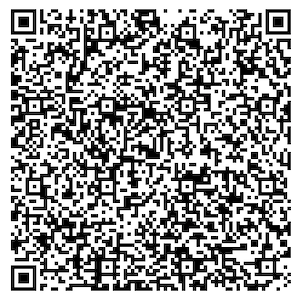

# Singapore - Test files

---

This directory contains test files produced by the [Notαrise](https://www.notarise.gov.sg/).

## Test files

### 1 - Vaccination certificate

[1.json](2DCode/raw/1.json) - Basic DGC with a second dose vaccination certificate entry.

All tests should be successful.

### 2 - Test certificate: NAT

[2.json](2DCode/raw/2.json) - Basic DGC with a Positive NAT test certificate entry.

All tests should be successful.

### 3 - Test certificate: RAT

[3.json](2DCode/raw/3.json) - Basic DGC with a Positive RAT test certificate entry.

All tests should be successful.

