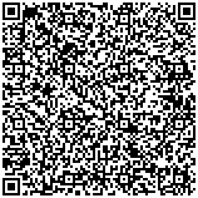
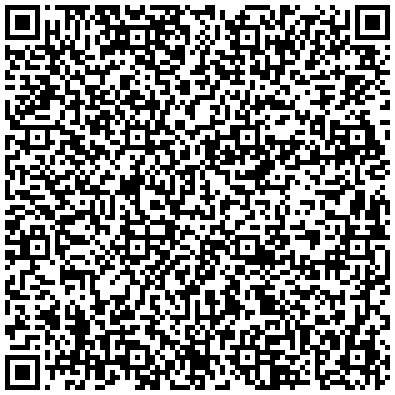
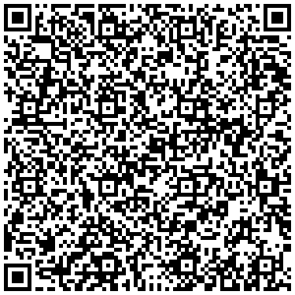
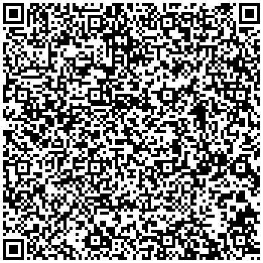
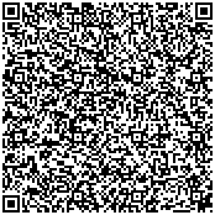

# Ukraine

This directory contains test files, signed by State Enterprise "DIIA".

## Test files

### Vaccination certificate (First Dose)

[1.json](2DCode/raw/1.json) - DCC with first vaccination entry dose.

All tests should be successful.

### Vaccination certificate (Second Dose)

[2.json](2DCode/raw/2.json) - DCC with second vaccination entry dose.

All tests should be successful.

### Recovery certificate

[3.json](2DCode/raw/3.json) - DCC with recovery entry.

All tests should be successful.

### Test certificate (NAA)

[4.json](2DCode/raw/4.json) - DCC with NAA-test entry.

All tests should be successful.

### Test certificate (RAT)

[5.json](2DCode/raw/5.json) - DCC with RAT-test entry.

All tests should be successful.

